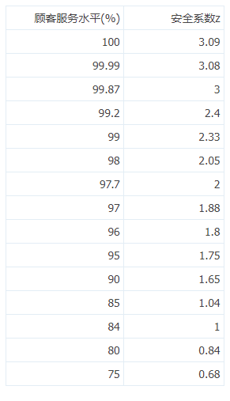

# 安全库存及相关指标计算

[原文](https://bbs.kuguanyi.com/thread-832-1-1.html)

安全库存（Safety Stock，SS）也称安全存储量，又称保险库存，是指为了防止不确定性因素（如大量突发性订货、交货期突然延期、临时用量增加、交货误期等特殊原因）而预计的保险储备量（缓冲库存）。

　　**什么是安全库存：**

　　安全库存（又称保险库存）是指为了防止由于不确定因素（如突发性大量订货或供应商延期交货）影响订货需求而准备的缓冲库存

　　**安全库存的计算公式**

　　安全存储量=预计每天或每周的平均耗用量*（订单处理期+供应商之纳期）+日安全库存.

　　安全存储量=预计每天或每周的平均耗用量*（订单处理期+供应商之纳期+厂内之生产周期）+日安全库存.

　　**安全库存的原则**

　　1、不缺料导致停产（保证物流的畅通）；

　　2、在保证生产的基础上做最少量的库存；

　　3、不呆料。

　　**安全库存制定决定因素**

　　1、物料的使用频率(使用量）

　　2、供应商的交期

　　3、厂区内的生产周期(含外包）

　　4、材料的成本

　　5、订单处理期

　　以上以单位时间内来计。

　　**怎么确定哪些物料需要定安全库存**

　　运用A.B.C分析法确定了物料的A，B，C等级后根据A，B，C等级来制订库存：

　　A类料：一般属于成本较高，占整个物料成本的65%左右，可采用定期定购法，尽量没有库存或只做少量的安全库存.但需在数量上做严格的控制。

　　B类料：属于成本中等，占整个物料成本的25%左右，可采用经济定量采购的方法，可以做一定的安全库存。

　　C类料：其成本最少，占整个物料成本的10%左右，可采用经济定量采购的方式，不用做安全库存，根据采购费用和库存维持费用之和的最低点，订出一次的采购量。

　　**怎么降低“安全”库存**

　　1、订货时间尽量接近需求时间.

　　2、订货量尽量接近需求量

　　3、库存适量

　　但是与此同时，由于意外情况发生而导致供应中断、生产中断的危险也随之加大，从而影响到为顾客服务，除非有可能使需求的不确定性和供应的不确定性消除，或减到最小限度。这样，至少有4种具体措施可以考虑使用：

　　1、改善需求预测。预测越准，意外需求发生的可能性就越小。还可以采取一些方法鼓励用户提前订货；

　　2、缩短订货周期与生产周期，这一周期越短，在该期间内发生意外的可能性也越小；

　　3、减少供应的不稳定性。其中途径之一是让供应商知道你的生产计划，以便它们能够及早作出安排。

　　另一种途径是改善现场管理，减少废品或返修品的数量，从而减少由于这种原因造成的不能按时按量供应。还有一种途径是加强设备的预防维修，以减少由于设备故障而引发的供应中断或延迟；

　　4、运用统计的手法通过对前6个月甚至前1年产品需求量的分析，求出标准差后即得出上下浮动点后做出适量的库存。

　　最高库存量(成品)=最高日生产量×最短交付天数+安全系数/天

　　最低库存量(成品)=最低日生产量×最长交付天数+安全系数/天

　　最大库存量=平均日销售量×最高库存天数

　　最低库存量=安全库存+采购提前期内的消耗量

　　最低库存量=日销售量*到货天数+安全系数/天

　　安全库存量的大小，主要由顾客服务水平（或订货满足）来决定。所谓顾客服务水平，就是指对顾客需求情况的满足程度，公式表示如下：

　　顾客服务水平(5%)＝年缺货次数/年订货次数

　　顾客服务水平（或订货满足率）越高，说明缺货发生的情况越少，从而缺货成本就较小，但因增加了安全库存量，导致库存的持有成本上升；而顾客服务水平较低，说明缺货发生的情况较多，缺货成本较高，安全库存量水平较低，库存持有成本较小。因而必须综合考虑顾客服务水平、缺货成本和库存持有成本三者之间的关系，最后确定一个合理的安全库存量。

　　对于安全库存量的计算，将借助于数量统计方面的知识，对顾客需求量的变化和提前期的变化作为一些基本的假设，从而在顾客需求发生变化、提前期发生变化以及两者同时发生变化的情况下，分别求出各自的安全库存量。

　　1.需求发生变化，提前期为固定常数的情形

　　先假设需求的变化情况符合正态分布，由于提前期是固定的数值，因而我们可以直接求出在提前期的需求分布的均值和标准差。或者可以通过直接的期望预测，以过去提前期内的需求情况为依据，从而确定需求的期望均值和标准差。这种方法的优点是能够让人容易理解。

　　当提前期内的需求状况的均值和标准差一旦被确定，利用下面的公式可获得安全库存量SS。

　　SS=Z其中： ---在提前期内，需求的标准方差；

　　L ---提前期的长短；

　　Z---一定顾客服务水平需求化的安全系数(见下表)

　　顾客服务水平及安全系数表

例：

　　某饭店的啤酒平均日需求量为10加仑，并且啤酒需求情况服从标准方差是2加仑/天的正态分布，如果提前期是固定的常数6天，试问满足95%的顾客满意的安全库存存量的大小？

　　解：由题意知：

　　＝2加仑/天，L＝6天，F(Z)＝95％，则Z=1.65,

　　从而：SS=Z ＝1.65*2.* ＝8.08

　　即在满足95%的顾客满意度的情况下，安全库存量是8.08加仑。

　　2.提前期发生变化，需求为固定常数的情形

　　如果提前期内的顾客需求情况是确定的常数，而提前期的长短是随机变化的，在这种情况下：SS为

　　SS=Z 其中： ---提前期的标准差；

　　Z ----一定顾客服务水平需求化的安全系数；

　　d ----提前期内的日需求量；

　　例：

　　如果在上例中，啤酒的日需求量为固定的常数10加仑，提前期是随机变化的，而且服务均值为6天、标准方差为1.5的正态分的，试确定95％的顾客满意度下的安全库存量。

　　解：由题意知： ＝1.5天，d＝10加仑/天，F(Z)＝95％，则Z=1.65，

　　从而：SS= Z =1.65*10.*1.5=24.75

　　即在满足95％的顾客满意度的情况下，安全库存量是24.75加仑。

　　3.需求情况和提前期都是随机变化的情形

　　在多数情况下，提前期和需求都是随机变化的，此时，我们假设顾客的需求和提前期是相互独立的，则SS为

　　SS=Z

　　其中：Z ----一定顾客服务水平下的安全系数；

　　---提前期的标准差；

　　---在提前期内，需求的标准方差；

　　----提前期内的平均日需求量；

　　---平均提前期水平；

　　例：

　　如果在上例中，日需求量和提前期是相互独立的，而且它们的变化均严格满足正态分布，日需求量满足均值为10加仑、标准方差为2加仑的正态分布，提前期满足均值为6天、标准方差为1.5天的正态分布，试确定95％的顾客满意度下的安全库存量。

　　解：由题意知： ＝2加仑， ＝1.5天， ＝10加仑/天， ＝6天，F(Z)＝95％，则Z=1.65，从而：SS=Z ＝1.65* ＝26.04

　　即在满足95％的顾客满意度的情况下，安全库存量是26.04加仑